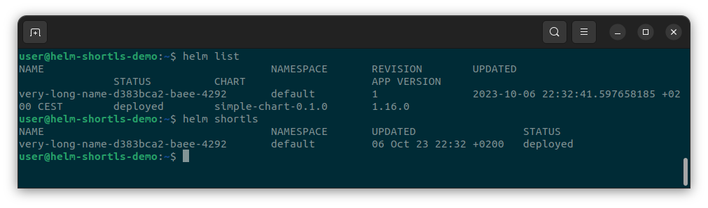

# helm shortls plugin
Helm **shortls** is a helm plugin to list deployed releases on k8s cluster in SHORT and clean format.

Have you ever found yourself in a situation where you're juggling multiple terminals in a single window, and you need to list all the deployed Helm releases on your cluster? It can be a real headache, especially when the command output is cluttered with excessive information, making it look downright messy.

Introducing our custom Helm "shorls "plugin – a game-changer designed to simplify your workflow and give you a sleek, organized output. We understand that clarity and efficiency matter, so we've crafted a solution that presents only the essential information in a clean and concise manner. With our plugin, each release's details are neatly condensed into a single line, even in the tightest of terminal windows.

In addition to streamlining Helm releases, another primary motivation behind creating this custom Helm plugin was personal growth and skill development in the Go programming language. Ideas, feedback, or contributions for potential enhancements or modifications to the plugin are welcome.

Experience the difference with our Helm **shortls** plugin – where efficiency meets elegance. Say goodbye to clutter and hello to clarity.

Happy helming!

## Install

At present, the only installation option available is to build from source code. To do this, simply clone the repository and run the commands `go build -o shortls .` and next `helm plugin install .` We are actively working on introducing additional installation options, so stay tuned for updates in the near future.

### Notes & useful links

Below are some links to useful websites or materials used during the design and implementation phase.

---
- https://helm.sh/docs/topics/advanced/
- https://pkg.go.dev/helm.sh/helm/v3@v3.12.2/pkg/action#Configuration
- https://cobra.dev/
- https://github.com/helm/helm/blob/main/cmd/helm/list_test.go
- https://dev.to/kcdchennai/how-to-create-your-first-helm-plugin-4i0g

